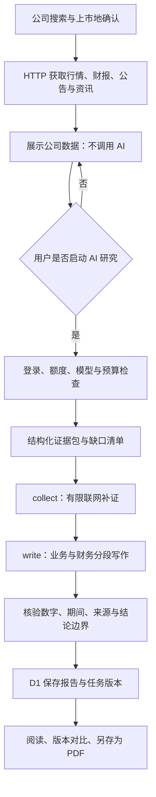

<p align="center">
  
</p>

<h1 align="center">透镜 · 基本面分析 Copilot</h1>

<p align="center">面向中文用户的市场数据与公司研究工作台</p>
<p align="center">从真实数据出发，理解业务、财务与事件之间的关系。</p>

<p align="center">
  <a href="https://toujing-fundamental-copilot.fengjiezhou2050.chatgpt.site">访问网站</a> ·
  <a href="#核心功能">核心功能</a> ·
  <a href="#ai-研究流程">研究流程</a> ·
  <a href="#本地开发">本地开发</a> ·
  <a href="#文档与验证">文档与验证</a>
</p>

> 当前产品版本：**V3.8**，更新于 **2026-09-08**。本仓库为私有源码仓库；网站按现有公开访问策略运行，AI 研究、个人报告和自选管理需登录。
>
> **仅用于信息整理与研究，不构成投资建议。** 不提供交易执行、收益承诺或自动买卖指令。数据与 AI 结论需要结合原始来源独立核验。

## 项目定位

透镜把市场观察、公司数据查询、深度研究和报告管理放在同一个中文界面中，回答三个问题：

- **发生了什么？** 查看指数、行业排行、行情、资金事件与近期资讯。
- **为什么值得关注？** 沿政策、行业供需、资金行为、财报和宏观因素追踪可能的影响。
- **证据是否支持结论？** 区分已披露事实、公司计划、机构预测和分析推断，保留来源与缺口。

项目采用“**数据先行、AI 按需**”的方式：搜索公司先展示数据接口返回的信息，用户明确选择 AI 研究后才生成分析报告。K 线与均线用于行情查看，不替代基本面研究，也不被当作公司内在价值的证据。

## 核心功能

### 市场总览

- 上证指数、深证成指、北证50、创业板指、上证50、沪深300与中证500。
- 行业热力图、行业内股票排行、强势股与题材入口。
- 按时间展示财经资讯；宏观与政策信号支持横向浏览和“查看全部”。
- PMI 等月频官方数据保留实际发布日期，不把页面刷新时间当作数据发布日。

### 行情数据与自选

- 股票、指数和 ETF 查询，区分同代码不同交易所或证券类型。
- 日、周、月及 5/15/30/60 分钟 K 线；十字光标、拖动缩放、成交量副图、键盘查看与全屏。
- MA5/10/20 基于当前展示周期与复权口径计算。
- 展示来源支持的五档盘口、PE/PB、总市值和流通市值；不适用或缺失字段留空说明。
- 前复权、后复权与不复权行情，以及 qfq/hfq 原始因子核验；不对已复权行情重复复权。
- 登录后保存自选证券、研究标签、备注和待验证事件，并在自选范围内按条件筛选。

不同市场和证券的能力并不完全相同：指数没有个股盘口，ETF 的交易市值不等于基金净资产，部分北交所复权因子暂无对应来源，页面按实际支持情况展示。

### 行业比较与行业排行

- 从数据源取得行业目录与成分证券，不只提供固定的几个行业。
- 行业内股票排行支持页面提供的涨跌、成交、估值等排序与分页条件。
- 板块资金区分行业／概念／地域，以及今日／5 日／10 日口径。
- AI 行业比较与纯数据浏览分开，只有明确提交 AI 分析才进入模型请求流程。

### 资金与事件

- 强势股样本与来源题材标签，个股行业／概念／地域归属。
- 个股分钟累计与日度资金流、板块资金流。
- 个股和全市场龙虎榜、披露日期与上榜原因。
- 解禁日历、个股解禁信息与近期公告。
- 港交所已披露的沪深港通日统计、活跃证券与北向季度持仓。

强势股样本不是全市场涨幅榜，题材标签不是已经证实的涨跌因果。北向日统计和季度持仓不等于“实时北向净流入”，项目不从缺失数据推造这类数值。

### 舆情互动

- 互动易问答、同花顺热榜、东方财富人气榜与个股概念命中信息。
- 按各接口的日期和新鲜度规则过滤，避免将过早信息混入当前观察。
- 区分投资者提问、公司回复、热度排行与概念标签，不将讨论热度直接当成业绩证据。

### 公司数据与 AI 深度研究

- 公司名、证券代码与联想搜索；多地上市公司可选择具体上市地。
- 搜索结果先展示公司数据，保留搜索栏，可继续切换目标。
- 明确启动 AI 研究后，结合财报、公告正文、行业与宏观资讯形成结构化报告。
- 展示研究阶段、已保存分段、错误和资料缺口；中断任务支持按条件手动续接。
- 分别核验行情、上市地、币种和财务期间，不用一个上市地的价格解释另一个上市地的估值。

### 市场 Agent

- 跨页面使用的浮动问答入口，可拖动、收起并保留对话状态。
- 结合有限的市场上下文回答问题，使用可读的来源引用。
- 与深度研究使用独立的模型偏好和上下文预算，避免普通问答携带整份研究资料。

### 我的报告与研究任务

- 已完成报告服务端保存，重新打开直接读取结果，不重新调用 AI。
- 独立保留任务结果、模型、研究框架／管线版本和证据时点。
- 同一证券的报告版本进行确定性比较，不额外调用模型。
- 通过浏览器打印布局将报告**另存为 PDF**，并支持相应的证据信息导出。
- 有限批量研究一次最多 3 家，确认预算后逐家执行；失败后停止，未启动任务可保留。

任务中心不是无人值守的后台执行队列。离开页面可能中断连接；续接取决于任务状态、租约及检查点有效期，不能保证永远零成本恢复。

### 用户与后台管理

- 登录、登出、账户切换、个人设置，以及日光／黑夜／跟随系统主题。
- 查看登录用户、最后活跃时间、研究次数及 AI 请求用量。
- 暂停／恢复 AI 研究权限，设置每日额度、可用模型和单报告 Token／美元预算。
- 记录请求接口、用户、模型、Token、联网请求及费用估算。
- 被动观察数据源成功／失败、耗时、缓存命中和来源日期，不用真实模型请求做健康检查。
- 侧栏从统一配置读取产品版本号。

## AI 研究流程

研究以业务驱动和证据链为核心，不以“多个角色反复讨论”作为默认实现。



### 研究标准

| 分析维度 | 核心问题 |
| --- | --- |
| 业务与利润来源 | 公司靠什么赚钱？收入基本盘、利润引擎和早期业务分别是什么？ |
| 经营驱动 | 产品销量、价格、原料、产能、客户与交付如何传导到利润和现金流？ |
| 行业供需与政策 | 需求和供给发生了什么？政策与宏观事件怎样影响这家公司？ |
| 竞争与壁垒 | 真正的同行是谁？技术、认证、规模或客户黏性有何证据与失效条件？ |
| 财务质量 | 多期收入、利润和现金流是否匹配？应收、存货、债务、资本开支有何风险？ |
| 新业务与投资 | 并表或权益法如何影响报表？研发、试产、投产、达产和销售是否被区分？ |
| 治理与资本配置 | 股东行为、关联交易、融资、募投与管理层信号是否支持经营目标？ |
| 估值与预期差 | PE 的期间与口径是什么？市场预期需要哪些经营条件才能成立？ |
| 情景、催化与风险 | 改善／基准／承压情景如何验证？哪些事实会推翻当前判断？ |
| 结论与资料缺口 | 哪些结论有依据，哪些仍不能判断？还需要补充什么披露？ |

完整标准见 [深度研究标准](docs/research-standard-v2.md) 与 [研究方法](docs/research-methodology.md)。参考报告用于学习分析方法和验收维度，**不把参考公司的数字作为其他公司报告的事实输入**。

### 真实性约束

- 优先使用正式披露和可核验原始数据，保留来源链接及可取得的正文摘录／页码。
- 不把缺失值填成零，不把“未检索到”写成“确定不存在”。
- 区分数据期、发布日期、行情时间与抓取时间，不混合币种、上市地和累计／时点口径。
- TTM 仅在期间与字段对齐时按“上年全年 + 本年累计 − 上年同期”计算，不对资产负债表余额滚动求和。
- 不机械年化半年利润，不将亏损 PE 解读为低估，不捏造市场份额、历史估值分位、目标价或情景概率。
- 无法核验的结论保留缺口或限制，不生成看似完整的填充内容。

这些是系统约束与验收目标，不是对每份 AI 报告无错误的保证。

## 数据来源与更新方式

项目参考 [a-stock-data](https://github.com/t0mAto1104/a-stock-data) 的接口与数据口径，在当前托管环境中采用 **HTTP + D1**。不启动该 Skill 的 Python／TCP 服务，也没有把整份 Skill 放入模型提示词。

| 数据类别 | 当前主要来源 | 重要边界 |
| --- | --- | --- |
| 行情、K 线与估值快照 | 腾讯财经、东方财富及适用备用源 | 公开 HTTP 数据不是交易所级逐笔实时服务；不同字段有各自时间与口径 |
| 财报、公司资料、研报与公告 | 新浪财经、东方财富、巨潮资讯及其他已适配来源 | 完整性取决于证券覆盖、披露情况与接口可达性 |
| 行业、资金与交易事件 | 东方财富、同花顺、港交所 | 资金统计、题材样本和法定披露不能混为一谈 |
| 宏观与政策 | 国家统计局、中国人民银行、新浪财经与东方财富快讯 | 官方数据按发布周期更新；快讯保留原始时间 |
| 官方补充数据 | 中证／国证指数、沪深北交易所等已适配端点 | 按功能分别核验交易日、成分、权重、估值和两融口径 |
| 舆情与互动 | 互动易、同花顺、东方财富 | 热度、问答和概念命中不是已验证的经营结论 |

更新由页面访问、可见页面轮询或用户操作触发，复用缓存与失败降级；**没有为了保持网站运转而设置后台 OpenAI 定时消耗**。

- 行情与 K 线按页面可见性、交易时段和接口缓存刷新；自动刷新频率不等于上游数据延迟承诺。
- 最新财经快讯缓存约 10 分钟；官方宏观快照按日分键，缓存约 12 小时。
- V3.8 的宏观分类历史缓存约 30 分钟，回溯**前 7 个自然日加当天**；宏观与央行分类使用有界游标分页。
- 历史数据与最新 30 条财经快讯分开，避免被当天非宏观消息挤出。更早官方资料为精选，不宣称覆盖全年每一条资讯。
- 回溯未完整完成、源不可用或缓存过期时明确提示；“没有取得数据”不等于“期间没有事件”。

## Token 与成本控制

| 操作 | 是否发起新的模型请求 |
| --- | --- |
| 浏览行情、热力图、资金事件、舆情或公司数据 | 否 |
| HTTP 新闻更新、读取任务状态、配置状态检查 | 否 |
| 打开已保存报告、比较版本、打印为 PDF | 否 |
| 提交市场 Agent 问答、AI 行业比较或公司研究 | 是，需通过登录与权限检查 |
| 手动续接中断任务 | 可能；有效检查点优先复用，过期或缺失阶段可能再次计费 |

流程采用有限补证、精简证据包、分段写作和检查点复用，避免每个阶段重复发送完整材料。历史宏观列表不扩充市场 Agent 的 `news` 上下文。

管理员可控制模型白名单、每日研究次数及单报告预算。请求先做预算预留，再按实际返回用量结算；未知用量不按零计费处理。

**页面费用是估算，不是供应商账单硬封顶。** 模型、缓存、联网、失败请求与费率变化都会影响实际支出。项目内的模型选项与费率配置不代表任意账户均有相应调用权限。

## 技术架构

| 层次 | 实现 |
| --- | --- |
| 前端 | React 19、TypeScript、Tailwind CSS、现有 Shadcn／Base UI 组件 |
| 应用与构建 | Vinext、Vite |
| 图表 | Lightweight Charts、Recharts |
| 服务端 | Cloudflare Workers 兼容 HTTP API |
| 持久化 | D1：用户、报告、任务、用量、自选与共享快照 |
| 数据适配 | 直接 HTTP 请求，统一超时、限流、来源校验与缓存回退 |
| AI | 现有 OpenAI 调用封装、模型策略与用量记录 |
| 托管 | Sites；源码备份与网站部署分别管理 |

```text
app/             页面、API、认证入口
components/      行情、搜索、报告、Agent 与管理界面
lib/             数据适配、研究管线、权限、预算及存储
db/              数据库结构定义
drizzle/         数据库迁移及对应元数据
public/          Logo 与静态资源
docs/            研究标准、功能说明及历史验收记录
tests/           离线回归测试与运行适配器
scripts/         研究取证检查与评估辅助脚本
```

## 本地开发

### 获取代码与安装依赖

仓库为私有，需要访问权限及本机 GitHub 身份验证。

```bash
git clone https://github.com/t0mAto1104/toujing-fundamental-copilot.git
cd toujing-fundamental-copilot
npm ci
cp .env.example .env.local
```

`package.json` 声明 Node.js ≥ 22.13。完整测试执行器还使用 `node:module.registerHooks`，请使用支持该 API 的版本；本轮验证使用 Node.js **26.8.1**。

### 配置运行环境

在本机编辑 `.env.local`，不要把真实值提交到 Git：

| 配置项 | 用途 |
| --- | --- |
| `OPENAI_API_KEY` | 需要 AI 功能时配置，仅保留在服务端 |
| `SITE_ADMIN_EMAILS` | 可选管理员邮箱列表，逗号分隔 |
| `OPENAI_MODEL` | 可选服务端模型覆盖，仍受应用权限与实际可用性限制 |

数据查询链路不要求新增数据 API Key。用户、任务、报告和自选功能需要正确的 D1 绑定，并按 `drizzle/` 的迁移顺序初始化本地数据库。能打开首页不代表数据库与认证已经配置完成。

### 启动与验证

```bash
npm run dev
npm run build
npx tsc --noEmit
node --import ./tests/runtime.mjs --test tests/*.test.ts
```

开发地址以启动输出为准。离线测试使用模拟数据和认证环境，不产生真实模型费用；`scripts/` 中真实研究评估脚本并非离线测试，运行前需确认其请求与预算。

`npm run lint` 可单独运行；现有未改动基础组件仍有历史 lint 问题，不应把它描述为全仓库零告警。

## 部署与安全边界

当前 `.openai/hosting.json` 指向现有 Sites 项目，记录站点标识与逻辑资源绑定，不是访问凭据。

- **同步到 GitHub 不等于重新部署网站。** 生产发布需要独立完成构建、源码版本保存与部署。
- 新建自己的站点时，必须注册自己的托管资源，不能沿用现有项目标识覆盖原站点。
- 登录依赖托管网关注入的可信身份头与登录／登出路由。迁移至其他平台需适配认证，并阻止外部伪造身份头。
- API Key 使用服务端运行时密钥配置，不能写入浏览器、URL、README 或示例代码。
- 生产 D1 迁移按顺序执行，已发布迁移保持不可变；升级前应独立备份业务数据。
- 公共接口可能限流、变更或不可用，缓存与备用源不能提供无条件可用性保证。

开发 Skill 不是网站运行依赖，其固定来源、版本和本机安装约定见 [AGENTS.md](AGENTS.md)。

## 文档与验证

| 文档 | 内容 |
| --- | --- |
| [研究标准](docs/research-standard-v2.md) | 分析维度、证据要求与参考报告验收方法 |
| [研究方法](docs/research-methodology.md) | 研究框架与适用边界 |
| [研究工作台](docs/research-workbench.md) | 任务、预算、报告版本、自选研究与有限批量 |
| [成本优化验证](docs/research-cost-validation-2026-09-06.md) | collect/write 与成本控制检查 |
| [行情验证](docs/market-quotes-validation.md) | K 线、盘口、复权与自选 |
| [资金与事件验证](docs/market-signals-validation.md) | 资金、龙虎榜、北向与解禁口径 |
| [官方数据验证](docs/official-data-validation-2026-09-08.md) | a-stock-data 官方补充端点接入 |

截至 V3.8，本轮 **154 项离线测试通过**，类型检查与生产构建通过；线上核验取得了 2026-09-01 至 2026-09-07 的宏观历史记录。

验证文档是各轮工作完成时的快照，“尚未发布”等文字描述当时状态；当前 V3.8 已于 2026-09-08 公开发布。自动测试通过不等于所有公司、模型、行情端点均完成真实研究与浏览器端到端验收。

## V3.8 更新摘要

- 宏观／央行分类历史分页回溯与 D1 缓存，修复最新快讯后直接跳到旧月频数据的问题。
- 处理短页、重复游标、无效日期和部分失败，保留可核验记录，不以伪造资讯补日期。
- 宏观页支持刷新与有界补读，标注历史覆盖和旧快照状态。
- 产品版本号集中在 `lib/site-version.ts`，侧栏显示 V3.8，与 a-stock-data Skill 版本相互独立。
- 本次同步也补齐此前行情、资金事件、舆情、行业排行、研究任务与预算管理等源码更新。

## GitHub 备份范围

仓库保存当前源码、静态资源、依赖锁文件、数据库结构／迁移、测试与文档。本次更新基于 GitHub 已有主分支追加提交，保留已有提交及 `backups/source-history-2026-09-04.bundle`。

该 bundle 是 **2026-09-04 的历史备份**，不是当前 V3.8 的完整历史镜像。当前版本以主分支源码为准；Sites 与 GitHub 的提交历史分别维护，不承诺二者逐条 SHA 一致。

不包含真实 API Key、`.env.local`、登录凭据、用户数据库、私人报告、依赖安装目录、构建产物或 Codex 对话和会话数据库。运行中用户数据应独立进行受保护的数据库备份，不能用源码备份替代。

## 参考与致谢

- [a-stock-data](https://github.com/t0mAto1104/a-stock-data)：数据端点、来源优先级与口径核验参考。
- [TradingAgents](https://github.com/TauricResearch/TradingAgents)：分工研究与证据组织思路参考。
- [TradingAgents-CN](https://github.com/hsliuping/TradingAgents-CN)：中文研究工作台、任务管理和运营能力的产品思路参考。
- [awesome-design-md](https://github.com/t0mAto1104/awesome-design-md)：界面设计语言参考。
- [ponytail](https://github.com/t0mAto1104/ponytail)：优先复用、控制复杂度的开发约束。

透镜不是上述项目的官方产品或完整移植版；当前未引入 TradingAgents-CN 的应用源码，也没有照搬其交易执行或多智能体辩论架构。参考不代表关联、背书或授权，第三方代码、资源与服务各自的许可和使用条件仍需遵守。

本仓库当前没有声明项目级开源许可证，请勿据此推断存在公开再分发或商业使用授权。
