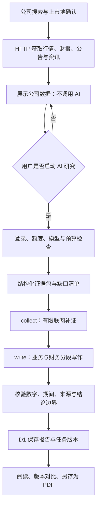

<p align="center">
  
</p>

<h1 align="center">透镜 · 基本面分析 Copilot</h1>

<p align="center">面向中文用户的市场数据、AI 研究与笔记工作台</p>
<p align="center">从真实数据出发，理解业务、财务与事件之间的关系。</p>

<p align="center">
  <a href="https://toujing.fengjiezhou2050.chatgpt.site">访问网站</a> ·
  <a href="#核心功能">核心功能</a> ·
  <a href="#ai-研究流程">研究流程</a> ·
  <a href="#本地开发">本地开发</a> ·
  <a href="#文档与验证">文档与验证</a>
</p>

> 当前产品版本：**V3.10.5**，以 [`lib/site-version.ts`](lib/site-version.ts) 为准；本介绍同步于 **2026-09-27**。本仓库公开提供项目源码；AI 研究、个人报告、自选管理与账号笔记需登录。GitHub 源码同步与网站发布分别管理。
>
> **仅用于信息整理与研究，不构成投资建议。** 不提供交易执行、收益承诺或自动买卖指令。数据与 AI 结论需要结合原始来源独立核验。

## 项目定位

透镜把市场观察、公司数据查询、自定义研报、行业研究和个人笔记放在同一个中文界面中，回答三个问题：

- **发生了什么？** 查看指数、行业排行、行情、资金事件与近期资讯。
- **为什么值得关注？** 沿政策、行业供需、资金行为、财报和宏观因素追踪可能的影响。
- **证据是否支持结论？** 区分已披露事实、公司计划、机构预测和分析推断，保留来源与缺口。

项目采用“**数据先行、AI 按需**”的方式：搜索公司先展示数据接口返回的信息，用户明确选择 AI 研究后才生成分析报告。K 线与均线用于行情查看，不替代基本面研究，也不被当作公司内在价值的证据。

## 核心功能

### 市场总览

- 上证指数、深证成指、北证50、创业板指、上证50、沪深300与中证500。
- 行业热力图、行业内股票排行、强势股与题材入口。
- 按时间展示财经资讯；宏观与政策信号支持横向浏览和“查看全部”。
- PMI 等月频官方数据保留实际发布日期，不把页面刷新时间当作数据发布日。

### 行情数据与自选

- 股票、指数和 ETF 查询，区分同代码不同交易所或证券类型。
- 日、周、月及 5/15/30/60 分钟 K 线；十字光标、拖动缩放、成交量副图、键盘查看与全屏。
- MA5/10/20 基于当前展示周期与复权口径计算。
- 展示来源支持的五档盘口、PE/PB、总市值和流通市值；不适用或缺失字段留空说明。
- 前复权、后复权与不复权行情，以及 qfq/hfq 原始因子核验；不对已复权行情重复复权。
- 登录后保存自选证券、研究标签、备注和待验证事件，并在自选范围内按条件筛选。

不同市场和证券的能力并不完全相同：指数没有个股盘口，ETF 的交易市值不等于基金净资产，部分北交所复权因子暂无对应来源，页面按实际支持情况展示。

### 行业研究与行业研报

- 从数据源取得行业目录与成分证券，不只提供固定的几个行业。
- `/industry` 默认进入单行业研究，保留双行业比较和板块资金页签；使用精确行业代码，展示成分股及按当日涨幅排序的前十。榜单是行情样本，不是推荐名单或基本面排名。
- 手动生成政策、行业、资金、财报、宏观五维研究，展示事实依据、传导机制、反证、验证指标，以及可推翻判断的条件。
- 复用账户 BYOK、研究模型偏好与用量审计；每次单行业研究最多一次模型请求和两次联网工具调用，不自动重试。行情刷新不会自动生成或改写 AI 结论。
- 板块资金区分行业／概念／地域，以及今日／5 日／10 日口径。可见页面按交易状态刷新，分别展示来源时间和获取时间，旧快照或来源时间缺失时明确提示。
- 独立「行业研报」入口支持来源切换、搜索、分页及原文链接，保留发布日、机构等来源信息。上游不可用时提示缺失或旧快照，不用模拟研报填补。

### 资金与事件

- 强势股样本与来源题材标签，个股行业／概念／地域归属。
- 个股分钟累计与日度资金流、板块资金流。
- 个股和全市场龙虎榜、披露日期与上榜原因。
- 解禁日历、个股解禁信息与近期公告。
- 港交所已披露的沪深港通日统计、活跃证券与北向季度持仓。

强势股样本不是全市场涨幅榜，题材标签不是已经证实的涨跌因果。北向日统计和季度持仓不等于“实时北向净流入”，项目不从缺失数据推造这类数值。

### 舆情互动

- 互动易问答、同花顺热榜、东方财富人气榜与个股概念命中信息。
- 按各接口的日期和新鲜度规则过滤，避免将过早信息混入当前观察。
- 区分投资者提问、公司回复、热度排行与概念标签，不将讨论热度直接当成业绩证据。

### 公司数据与 AI 深度研究

- 公司名、证券代码与联想搜索；多地上市公司可选择具体上市地。
- 搜索结果先展示公司数据，保留搜索栏，可继续切换目标。
- 公司资料新增近一年股价／PE 历史百分位、前十大股东占比和基金持股占比，附统计期间、实际样本数和源数据链接。价格采用前复权日收盘价，PE 采用 TTM，持股占比统一以总股本为分母；当前覆盖沪深北 A 股，不将 A 股数据套用到港美上市证券。
- 同行候选与估值参考按已核验行业和市值距离选取，披露样本、时间、排除原因与可比性限制；行业相同不等于业务可比。
- 明确启动 AI 研究后，结合财报、公告正文、行业与宏观资讯形成结构化报告。
- 核对最近应披露期间与年报／中报正文覆盖，在有界 HTTP 补采和联网预算内补读缺失披露、公司介绍、发展历程及行业证据。接口失败、未披露、不适用与真实资料缺口分别记录。
- 财务计算底稿保留原值、公式、期间、币种、单位、来源与证据指纹；同比、单季、TTM 及简化现金结余由程序计算，AI 使用有界摘要解释。银行、券商等按已核验行业使用对应经营指标。
- 报告提供 3／5 年财务与估值历史图、指标切换和数据明细。年度、累计与 TTM 分开，非正估值、缺失值及不可比口径留空；图表与来源冻结在报告资料时点。
- 展示研究阶段、已保存分段、错误和资料缺口；中断任务支持按条件手动续接。
- 分别核验行情、上市地、币种和财务期间，不用一个上市地的价格解释另一个上市地的估值。

### 市场 Agent

- 跨页面使用的浮动问答入口，可拖动、收起并保留对话状态。
- 仅回答金融问题：先检查话题与隐私，再按需检索公开资料，展示前独立复核输出；非金融或未通过核验的结果不展示。
- 时效性问题最多调用 1 次只读联网搜索，来源限监管、交易所、公告及财经媒体；纯金融概念可不联网。来源显示为可点击的站点名，不输出长链接。
- 网页、公告和快照均视为不可信数据，不接收其中的命令。最近六条且合计最多2400字的历史仅供无工具范围核验和追问改写；联网不携带原始对话、账户信息或客户端页面自由文本，没有交易、文件、账户操作工具。安全设计、成本及剩余风险见 [市场 Agent 安全联网](docs/market-agent-web-safety.md)。
- 常见金融定义使用零模型快路径；汇率问题改用受限联网搜索，不再直连央行汇率数据接口。“美元汇率”“日元汇率”等简写默认兑人民币并提示假设，回答需区分日期和报价口径，不能把旧数据当实时成交价。其他纯概念问答减少为两次调用，复杂多模块分析推荐手动进入 AI自定义研报。
- 聊天历史按账户保存在当前浏览器，可跨页恢复并逐批查看更早记录；完整历史不全量发送模型。整页刷新可中断未完成请求，不自动重发；不支持跨设备同步。
- 与深度研究使用独立的模型偏好和上下文预算，避免普通问答携带整份研究资料。

### AI 自定义研报

- 统一导航「AI自定义研报」进入 `/report-builder`；`/research` 与原 `/report-builder-demo` 复用同一编辑器、模板和任务创建流程。
- 18 个可选模块，默认简版启用 7 个，深度版启用 17 个；可调整模块顺序、内容要求、篇幅、单／双栏与分页。
- 编辑和预览不调用 AI。选择公司与允许使用的模型、确认生成后，所选模块实际参与资料补证和分段写作，不是生成整份固定报告后隐藏章节。
- 财务表格、计算底稿、行情快照、研究方法与来源等程序输出不安排模型重复编写；来源与缺口固定保留。
- 使用原有登录、BYOK、模型权限、单报告预算和用量审计；不增加后台 AI 定时任务。
- 模板随研究任务及结果保存，续接时复用同一份模板与有效分段；完成后从「我的报告」直接打开并另存 PDF。
- 编辑器「保存模板」将结构、顺序、内容要求与篇幅保存在当前浏览器，刷新后恢复；也可下载生成要求 JSON。提交后的模板随任务／报告持久化到 D1，编辑器尚不提供跨设备账户模板库。
- 简版、深度版与自定义要求共用证据约束；结论按可用证据标明条件分析、局部分析或暂缓综合判断。页数是篇幅预算目标，实际 PDF 自然分页，不截断证据。

### 账号笔记本

- 首页与工作台右上角共用全站笔记浮窗；每个登录账号一份富文本笔记，停止编辑后自动保存到 D1，不调用 AI。
- 支持拖动、四边与四角共八个方向缩放、最大化／还原和最小化；窗口及最小化条的位置可在刷新后恢复，并适配屏幕边界。
- 支持字号、加粗、斜体、文字颜色、高亮、撤销、中文输入与纯文本粘贴；可导出保留格式的 HTML 或 TXT。
- 本次打开后未修改，或内容为空／只有空白时，关闭不弹提示。修改后非空则提供保存、导出、取消或明确删除选项；「不保存，删除」会清空账号笔记，包括已自动保存的内容。
- 使用账号隔离与修订号处理并发保存，冲突不静默覆盖；保存失败时保留可导出内容。行为与数据边界见 [账号笔记本](docs/notebook.md)。

### 我的报告与研究任务

- 已完成报告服务端保存，重新打开直接读取结果，不重新调用 AI。
- 独立保留任务结果、模型、模板、研究框架／管线版本和证据时点。
- 同一证券的报告版本进行确定性比较，展示方法、计算、证据与缺口变化，不额外调用模型。
- 通过浏览器打印布局将报告**另存为 PDF**，并支持相应的证据信息导出。
- 有限批量研究一次最多 3 家，确认预算后逐家执行；失败后停止，未启动任务可保留。
- 分段检查点与存活租约分离，过期任务释放名额，停止后阻止旧执行器继续写入或启动下一阶段。连接中断后可只读找回已完成结果；未完成任务由用户手动续接，不自动重发收费请求。

任务中心不是无人值守的后台执行队列。离开页面可能中断连接；续接取决于任务状态、租约及检查点有效期，不能保证永远零成本恢复。

### 用户与后台管理

- 登录、登出、账户切换、个人设置，以及日光／黑夜／跟随系统主题。
- 查看登录用户、最后活跃时间、研究次数及 AI 请求用量。
- 暂停／恢复 AI 研究权限，设置可用模型和单报告 Token／美元预算；每日研究次数只统计、不设上限。
- 记录请求接口、用户、模型、Token、联网请求及费用估算。
- 被动观察数据源成功／失败、耗时、缓存命中和来源日期，不用真实模型请求做健康检查。
- 侧栏从统一配置读取产品版本号。
- 手机／平板窄屏通过左上角菜单展开完整导航及账户设置，桌面继续显示固定侧栏。

## AI 研究流程

研究以业务驱动和证据链为核心，不以“多个角色反复讨论”作为默认实现。


```mermaid
flowchart TD
  A[公司搜索与上市地确认] --> B[HTTP 获取行情、财报、公告与资讯]
  B --> C[展示公司数据：不调用 AI]
  C --> D{用户是否启动 AI 研究}
  D -->|否| C
  D -->|是| E[登录、额度、模型与预算检查]
  E --> F[结构化证据包与缺口清单]
  F --> G[collect：有限联网补证]
  G --> H[write：业务与财务分段写作]
  H --> I[核验数字、期间、来源与结论边界]
  I --> J[D1 保存报告与任务版本]
  J --> K[阅读、版本对比、另存为 PDF]
```

### 研究标准

| 分析维度 | 核心问题 |
| --- | --- |
| 业务与利润来源 | 公司靠什么赚钱？收入基本盘、利润引擎和早期业务分别是什么？ |
| 经营驱动 | 产品销量、价格、原料、产能、客户与交付如何传导到利润和现金流？ |
| 行业供需与政策 | 需求和供给发生了什么？政策与宏观事件怎样影响这家公司？ |
| 竞争与壁垒 | 真正的同行是谁？技术、认证、规模或客户黏性有何证据与失效条件？ |
| 财务质量 | 多期收入、利润和现金流是否匹配？应收、存货、债务、资本开支有何风险？ |
| 新业务与投资 | 并表或权益法如何影响报表？研发、试产、投产、达产和销售是否被区分？ |
| 治理与资本配置 | 股东行为、关联交易、融资、募投与管理层信号是否支持经营目标？ |
| 估值与预期差 | PE 的期间与口径是什么？市场预期需要哪些经营条件才能成立？ |
| 情景、催化与风险 | 改善／基准／承压情景如何验证？哪些事实会推翻当前判断？ |
| 结论与资料缺口 | 哪些结论有依据，哪些仍不能判断？还需要补充什么披露？ |

完整标准见 [深度研究标准](docs/research-standard-v2.md) 与 [研究方法](docs/research-methodology.md)。参考报告用于学习分析方法和验收维度，**不把参考公司的数字作为其他公司报告的事实输入**。

### 真实性约束

- 优先使用正式披露和可核验原始数据，保留来源链接及可取得的正文摘录／页码。
- 不把缺失值填成零，不把“未检索到”写成“确定不存在”。
- 区分数据期、发布日期、行情时间与抓取时间，不混合币种、上市地和累计／时点口径。
- TTM 仅在期间与字段对齐时按“上年全年 + 本年累计 − 上年同期”计算，不对资产负债表余额滚动求和。
- 不机械年化半年利润，不将亏损 PE 解读为低估，不捏造市场份额、历史估值分位、目标价或情景概率。
- 无法核验的结论保留缺口或限制，不生成看似完整的填充内容。
- 资料缺口不一律否决所有分析；仅在证据支持的范围内形成结论，保留冲突、反证与尚未核验的边界。证据指纹和计算核验不等于每句话均经人工审计。

这些是系统约束与验收目标，不是对每份 AI 报告无错误的保证。

## 数据来源与更新方式

项目参考 [a-stock-data](https://github.com/t0mAto1104/a-stock-data) 的接口与数据口径，在当前托管环境中采用 **HTTP + D1**。固定上游 v3.10.0 原版文件归档在 [`vendor/skills/a-stock-data`](vendor/skills/a-stock-data)，版本与校验哈希记录于 [`lib/a-stock-version.ts`](lib/a-stock-version.ts)。不启动该 Skill 的 Python／TCP 服务，也没有把整份 Skill 放入模型提示词。

| 数据类别 | 当前主要来源 | 重要边界 |
| --- | --- | --- |
| 行情、K 线与估值快照 | 腾讯财经、东方财富及适用备用源 | 公开 HTTP 数据不是交易所级逐笔实时服务；不同字段有各自时间与口径 |
| 财报、公司资料、研报与公告 | 新浪财经、东方财富、巨潮资讯及其他已适配来源 | 完整性取决于证券覆盖、披露情况与接口可达性 |
| 行业、资金与交易事件 | 东方财富、同花顺、港交所 | 资金统计、题材样本和法定披露不能混为一谈 |
| 宏观与政策 | 国家统计局、中国人民银行、新浪财经与东方财富快讯 | 官方数据按发布周期更新；快讯保留原始时间 |
| 官方补充数据 | 中证／国证指数、沪深北交易所等已适配端点 | 按功能分别核验交易日、成分、权重、估值和两融口径 |
| 舆情与互动 | 互动易、同花顺、东方财富 | 热度、问答和概念命中不是已验证的经营结论 |

股东与估值字段核验参考：[东方财富股东研究](https://emweb.securities.eastmoney.com/PC_HSF10/ShareholderResearch/Index?type=web&code=SH688146)、[历史估值接口映射](https://github.com/akfamily/akshare/blob/main/akshare/stock_feature/stock_value_em.py)。样本与映射用于核验口径，不代表各证券均有完整覆盖。

更新由页面访问、可见页面轮询或用户操作触发，复用缓存与失败降级；**没有为了保持网站运转而设置后台 OpenAI 定时消耗**。

- 行情与 K 线按页面可见性、交易时段和接口缓存刷新；自动刷新频率不等于上游数据延迟承诺。
- 最新财经快讯缓存约 10 分钟；官方宏观快照按日分键，缓存约 12 小时。
- 宏观分类历史缓存约 30 分钟，回溯**前 7 个自然日加当天**；宏观与央行分类使用有界游标分页。
- 历史数据与最新 30 条财经快讯分开，避免被当天非宏观消息挤出。更早官方资料为精选，不宣称覆盖全年每一条资讯。
- 回溯未完整完成、源不可用或缓存过期时明确提示；“没有取得数据”不等于“期间没有事件”。

## Token 与成本控制

| 操作 | 是否发起新的模型请求 |
| --- | --- |
| 浏览行情、热力图、资金事件、舆情或公司数据 | 否 |
| HTTP 新闻更新、读取任务状态、配置状态检查 | 否 |
| 编辑／保存笔记、编辑／保存研报模板、预览生成要求 | 否 |
| 打开已保存报告、比较版本、打印为 PDF | 否 |
| 提交市场 Agent 问答 | 常见定义可零模型回答；其余问题按分流调用，需通过登录与权限检查 |
| 提交 AI 行业研究／比较或公司自定义研报 | 是，需通过登录与权限检查 |
| 手动续接中断任务 | 可能；有效检查点优先复用，过期或缺失阶段可能再次计费 |

流程采用有限补证、精简证据包、分段写作和检查点复用，避免每个阶段重复发送完整材料。历史宏观列表不扩充市场 Agent 的 `news` 上下文。

管理员可控制模型白名单及单报告预算。每日研究次数不设上限，仍记录用量。每位登录用户可在左下账户设置中分别选择普通问答及深度研究模型，偏好按账户存入 D1，跨设备读取，不再沿用共享浏览器模型设置。请求先做单报告预算预留，再按实际返回用量结算；未知用量不按零计费处理。

普通用户使用自己的 OpenAI 项目 Key（BYOK），费用由对应项目承担；管理员使用站点 Key。个人凭据缺失、无效、欠费或无模型权限时，不回退消耗站点 Key。凭据在服务端加密保存，设置界面只返回状态和末四位；BYOK 研究仍经本站后端发送给 OpenAI，不是浏览器本地执行。详见 [BYOK 安全与验收说明](docs/byok-security.md)。

**页面费用是估算，不是供应商账单硬封顶。** 模型、缓存、联网、失败请求与费率变化都会影响实际支出。项目内的模型选项与费率配置不代表任意账户均有相应调用权限。

## 技术架构

| 层次 | 实现 |
| --- | --- |
| 前端 | React 19、TypeScript、Tailwind CSS、现有 Shadcn／Base UI 组件 |
| 应用与构建 | Vinext、Vite |
| 图表 | Lightweight Charts、Recharts |
| 服务端 | Cloudflare Workers 兼容 HTTP API |
| 持久化 | D1：用户、加密凭据、模型偏好、报告、任务模板、笔记、用量、自选与共享快照 |
| 数据适配 | 直接 HTTP 请求，统一超时、限流、来源校验与缓存回退 |
| AI | 现有 OpenAI 调用封装、模型策略与用量记录 |
| 托管 | Sites；源码备份与网站部署分别管理 |

```text
app/             页面、API、认证入口
components/      行情、搜索、报告、Agent、笔记与管理界面
lib/             数据适配、研究管线、权限、预算及存储
db/              数据库结构定义
drizzle/         数据库迁移及对应元数据
public/          Logo 与静态资源
docs/            研究标准、功能说明及历史验收记录
tests/           离线回归测试与运行适配器
scripts/         研究取证检查与评估辅助脚本
vendor/          固定版本的上游原版资料与许可证
```

## 本地开发

### 获取代码与安装依赖

公开仓库可直接克隆；本地运行仍需配置自己的认证、数据库与服务端秘密。

```bash
git clone https://github.com/t0mAto1104/toujing-fundamental-copilot.git
cd toujing-fundamental-copilot
npm ci
cp .env.example .env.local
```

`package.json` 声明 Node.js ≥ 22.13。完整测试执行器还使用 `node:module.registerHooks`，请使用支持该 API 的版本。

### 配置运行环境

在本机编辑 `.env.local`，不要把真实值提交到 Git：

| 配置项 | 用途 |
| --- | --- |
| `OPENAI_API_KEY` | 管理员 AI 调用使用的站点 Key，仅保留在服务端；不作为普通用户的备用 Key |
| `BYOK_ENCRYPTION_KEY` | 个人 API Key 的独立加密主密钥，64 位十六进制值，仅保留在服务端秘密配置 |
| `SITE_ADMIN_EMAILS` | 可选管理员邮箱列表，逗号分隔 |
| `OPENAI_MODEL` | 可选服务端模型覆盖，仍受应用权限与实际可用性限制 |

数据查询链路不要求新增数据 API Key。用户、任务、报告、自选和笔记功能需要正确的 D1 绑定，并按 `drizzle/` 的迁移顺序初始化本地数据库。能打开首页不代表数据库与认证已经配置完成。

### 启动与验证

```bash
npm run dev
npm run build
npx tsc --noEmit
node --import ./tests/runtime.mjs --test tests/*.test.ts
node tests/openai-worker-runtime.mjs
```

开发地址以启动输出为准。离线测试使用模拟数据和认证环境，不产生真实模型费用。旧的 CLI 直连研究脚本已停用；真实模型验收从登录后的网页主动发起，运行前需确认费用与预算。个人密钥配置、加密与上线步骤见 [BYOK 安全与验收说明](docs/byok-security.md)。

`npm run lint` 可单独运行；现有未改动基础组件仍有历史 lint 问题，不应把它描述为全仓库零告警。

## 部署与安全边界

当前 `.openai/hosting.json` 指向现有 Sites 项目，记录站点标识与逻辑资源绑定，不是访问凭据。

- **同步到 GitHub 不等于重新部署网站。** 生产发布需要独立完成构建、源码版本保存与部署。
- 新建自己的站点时，必须注册自己的托管资源，不能沿用现有项目标识覆盖原站点。
- 登录依赖托管网关注入的可信身份头与登录／登出路由。迁移至其他平台需适配认证，并阻止外部伪造身份头。
- API Key 使用服务端运行时密钥配置，不能写入浏览器、URL、README 或示例代码。
- 生产 D1 迁移按顺序执行，已发布迁移保持不可变；升级前应独立备份业务数据。
- 公共接口可能限流、变更或不可用，缓存与备用源不能提供无条件可用性保证。

开发 Skill 不是网站运行依赖，其固定来源、版本和本机安装约定见 [AGENTS.md](AGENTS.md)。

## 文档与验证

| 文档 | 内容 |
| --- | --- |
| [研究标准](docs/research-standard-v2.md) | 分析维度、证据要求与参考报告验收方法 |
| [研究方法](docs/research-methodology.md) | 研究框架与适用边界 |
| [研究工作台](docs/research-workbench.md) | 任务、预算、报告版本、自选研究与有限批量 |
| [账号笔记本](docs/notebook.md) | 自动保存、窗口交互、关闭行为、导出与并发安全 |
| [行业研究与资金刷新](docs/industry-research-update.md) | 单行业五维研究、双行业比较、刷新与时效限制 |
| [市场 Agent 安全联网](docs/market-agent-web-safety.md) | 金融范围、受限搜索、输出复核与本机聊天历史 |
| [BYOK 安全与验收](docs/byok-security.md) | 个人密钥加密、计费隔离、模型偏好与部署配置 |
| [历史图表与产业研究](docs/research-history-and-industry.md) | 财务／估值历史、产业链及题材补证 |
| [财务计算底稿](docs/financial-workpapers-2026-09-22.md) | 同行候选、估值参考与简化现金结余 |
| [研究质量增强](docs/research-quality-v4.md) | 证据绑定、方法库、计算核验与分段恢复 |
| [最新披露与银行资料修复](docs/research-bank-data-repair.md) | 财务字段、历史估值、正文定向补采与行业规则 |
| [公司背景与券商研究](docs/research-company-context-repair.md) | 公司介绍、发展历程、券商指标及缺口分类 |
| [按证据范围形成结论](docs/research-scoped-conclusion.md) | 条件分析、局部分析与暂缓综合判断 |
| [任务与内存恢复](docs/research-task-recovery.md) | 租约、取消、检查点、PDF 解析及完成结果恢复 |
| [成本优化验证](docs/research-cost-validation-2026-09-06.md) | collect/write 与成本控制检查 |
| [行情验证](docs/market-quotes-validation.md) | K 线、盘口、复权与自选 |
| [资金与事件验证](docs/market-signals-validation.md) | 资金、龙虎榜、北向与解禁口径 |
| [官方数据验证](docs/official-data-validation-2026-09-08.md) | a-stock-data 官方补充端点接入 |
| [a-stock-data v3.10 适配](docs/a-stock-v310-adaptation.md) | 固定上游版本、HTTP 适配范围及未启用能力 |

验证文档是各轮工作完成时的快照，包含当轮测试范围、真实 HTTP 样本与限制；其中“尚未发布”等文字描述当时状态，不能代替当前 Sites 发布记录。各文档测试数量仅对应当轮记录，当前验收请以上述命令的实际执行结果为准。

离线回归、浏览器合成场景、真实 HTTP 核验与付费模型报告验收分别记录。自动测试通过不等于所有公司、模型和行情端点均完成真实端到端验收；个别公开数据源曾返回访问错误，自动刷新与降级逻辑不能保证上游持续可用。

## GitHub 备份范围

仓库保存当前源码、Logo 等静态资源、依赖锁文件、数据库结构／迁移、测试、文档及固定上游资料。本次更新基于 GitHub 已有主分支追加提交，保留已有提交及 `backups/source-history-2026-09-04.bundle`。

该 bundle 是 **2026-09-04 的历史备份**，不是当前版本的完整历史镜像。当前版本以主分支源码为准；Sites 与 GitHub 的提交历史分别维护，不承诺二者逐条 SHA 一致。

不包含真实 API Key、`.env.local`、登录凭据、用户数据库、私人报告、依赖安装目录、构建产物或 Codex 对话和会话数据库。运行中用户数据应独立进行受保护的数据库备份，不能用源码备份替代。

## 参考与致谢

- [a-stock-data](https://github.com/t0mAto1104/a-stock-data)：数据端点、来源优先级与口径核验参考。
- [TradingAgents](https://github.com/TauricResearch/TradingAgents)：分工研究与证据组织思路参考。
- [TradingAgents-CN](https://github.com/hsliuping/TradingAgents-CN)：中文研究工作台、任务管理和运营能力的产品思路参考。
- [awesome-design-md](https://github.com/t0mAto1104/awesome-design-md)：界面设计语言参考。
- [ponytail](https://github.com/t0mAto1104/ponytail)：优先复用、控制复杂度的开发约束。

透镜不是上述项目的官方产品或完整移植版；当前未引入 TradingAgents-CN 的应用源码，也没有照搬其交易执行或多智能体辩论架构。参考不代表关联、背书或授权，第三方代码、资源与服务各自的许可和使用条件仍需遵守。

本仓库当前没有声明项目级开源许可证，请勿据此推断存在公开再分发或商业使用授权。
